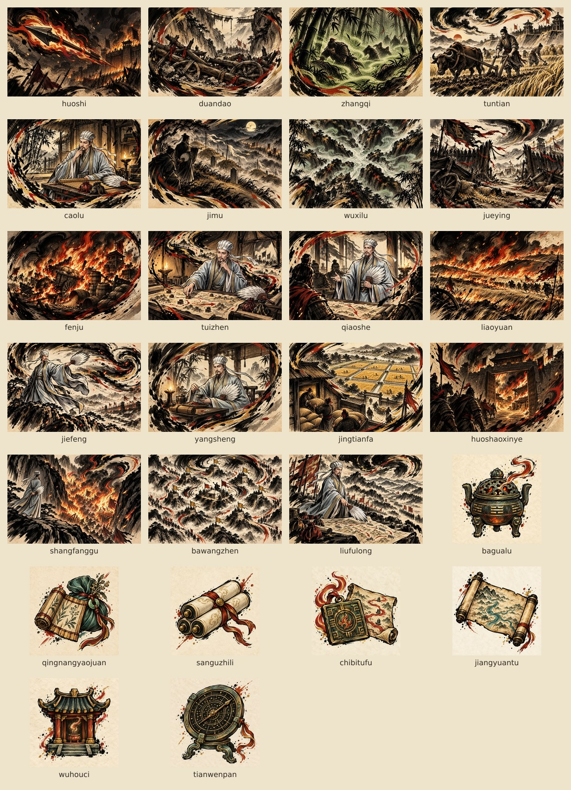

# 诸葛亮 · 卧龙定计

诸葛亮是以锦囊补手、以消耗堆兑现攻防的谋士。体力 68、资财 99，起手宝物「纶巾」使每回合有 4 气、抽 4 张牌。起手牌为 5 张元戎弩、4 张据守、1 张固有的隆中对。

常规模式累计通关两次解锁。已达门槛的旧存档在读取进度时自动补发，无需再通关；新账号仍按原门槛推进。

## 玩法闭环

| 构筑方向 | 启动与运转 | 兑现与取舍 |
| --- | --- | --- |
| 锦囊消耗 | 隆中对、草庐、推演、借箭之计制造零费锦囊；锦囊立甲并抽牌，消耗后推进计数 | 井田法、八卦炉与孔明灯提供护甲和续航；武侯祠积累神力，焚聚、火烧藤甲、上方谷收尾。需要提前留出手牌位置并保留输出牌。 |
| 火攻制阵 | 火矢、元戎弩提供常规输出，断道、巧舌、绝营削弱敌军，借风清理手牌 | 火烧博望坡、燎原、八望阵处理多敌，卧龙出山增强后续攻击，东风祭天消耗余气爆发。大招前先完成破绽与消耗堆的准备。 |
| 南征持久 | 瘴气、五溪、火烧新野积累中毒，井田法、屯田、养生维持防线 | 中毒绕过护甲扣血，力竭减少敌人后续获得的护甲；青囊药卷、江源图支持连续打出谋牌。需要持续上毒，不能只拿防守牌拖延。 |

42 张可获得牌、3 张起手牌和 1 张战斗内生成的锦囊，共 46 个定义；另有 9 件专属掉落宝物和起手纶巾。卡牌和宝物仍按武将分池，既有 ID、稀有度、奖励顺序、升级效果和起手数值沿用现行规则。

本次完成美术接入、选将开放和旧进度迁移；井田法卡面明确写出基础每次 2 甲、升级每次 3 甲。扩池与上一轮弱卡调整已有实现，保留其结果。

## 角色与美术锚点

固定人物为约四十岁的清瘦谋士：长脸、细长深色眼睛、平直眉、黑须与尖长髯；银灰折巾及飘带、灰白偏青宽袍、旧金滚边、白羽扇。沿用现有立绘和头像，含人物的新卡图引用同一张立绘来保持身份。

画风沿用黑色笔墨轮廓、米色纸纹、赭金设色和少量朱红；南征场景辅以低饱和青绿。卡图为横向 3:2 无字插画，宝物为方形纸底单物件。所有新增画作通过内置 GPT Image 生成，再按项目尺寸缩放：卡图 480 × 320 JPEG，宝物 256 × 256 PNG。

完整提示词、参考图和 26 个最终文件路径见 [GPT Image 素材记录](art/zhugeliang-gpt-image.json)。



| 类型 | 本次补齐的内容 | 最终目录 |
| --- | --- | --- |
| 卡图 · 19 张 | 火矢、断道、瘴气、屯田、草庐、疑冢、五溪、绝营、焚聚、推演、巧舌、燎原、借风、养生、井田法、火烧新野、上方谷、八望阵、六出祁山 | `public/assets/cards/` |
| 宝物 · 7 张 | 八卦炉、青囊药卷、三顾之礼、赤壁图符、江源图、武侯祠、天文盘 | `public/assets/relics/` |

## 试玩与验证

游戏内进入「自定义」→「测试战场 · 指定关卡」，默认选中诸葛亮，无需先通关解锁。选择幕与具体关卡，再点「开始测试」即可直接开战；也可换选关羽或赵云的初始牌组。

诸葛亮可选初始牌组，以及锦囊、南征、传世三份测试构筑。初始牌组使用正常的 68 体力和 4 气；三份构筑沿用下方快照的手牌、宝物、体力和额外气，但敌人的体力、护甲与行动使用所选关卡的正式配置。种子和天命沿用自定义页的选择，空种子使用固定测试种子。

战斗右上角「重选关卡」可返回测试页；胜败后可「再试一次」复现相同开局，或保留选择返回测试页。测试战斗不发征程奖励、不写征程存档、不计战史与解锁。

原有的固定战斗快照仍可通过开发命令打开：

```bash
bun run dev:scene zhugeliang-jinnang
bun run dev:scene zhugeliang-nanzheng
bun run dev:scene zhugeliang-legendary
```

三处场景分别验证消耗联动、南征中毒和传世牌。为便于连续比较，测试场景额外提供气与厚血敌人；正式开局仍为 4 气、68 体力。

回归检查覆盖两次通关解锁、旧进度补发、写入失败降级、完整素材加载，以及三条演示出牌顺序；锦囊测试还覆盖战斗存档恢复后的宝物与消耗计数。`bun run check` 检查类型和完整测试，`bun run build` 验证生产打包。

提交版本验证结果：`bun run check` 通过 68 个测试文件、4,862 项测试；`bun run build` 成功。浏览器使用“已通关两次但尚无诸葛亮”的旧进度，验证键盘选将、26 个真实图片纹理和三个战斗场景，无页面异常或素材加载失败。

`bun run sim -t 'per-hero balance'` 也通过现有检查：三名武将各 16 个场景，每场景 250 个固定种子，共 12,000 场战斗。它使用自动出牌策略，只作为构筑差异的观测，不代表真实玩家胜率。既有的诸葛亮对张宝长局仍有 1 次触及 60 回合保护上限，该格标为无效；未通过提高上限或修改其他武将来掩盖。其余带外指标保留为后续平衡观察。
